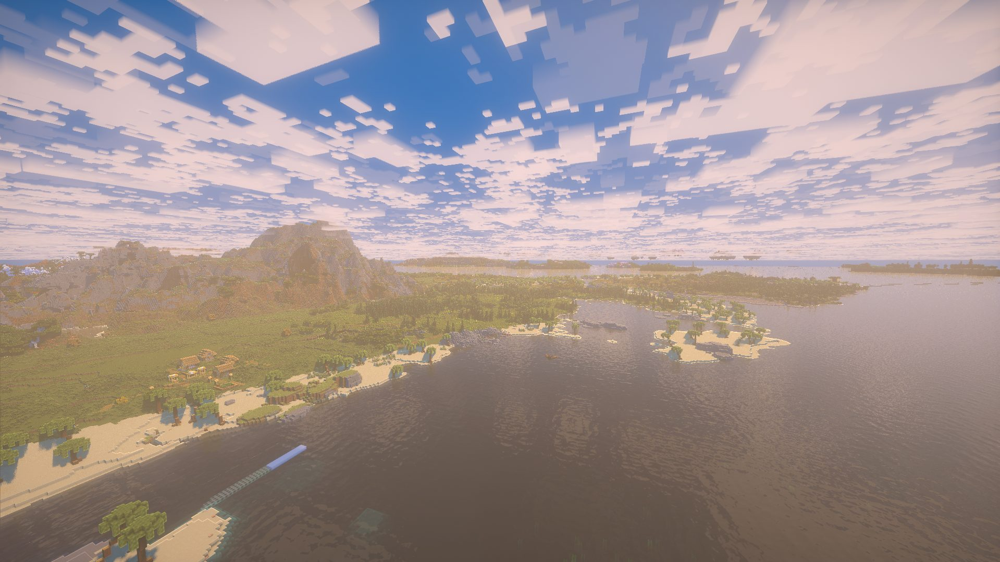
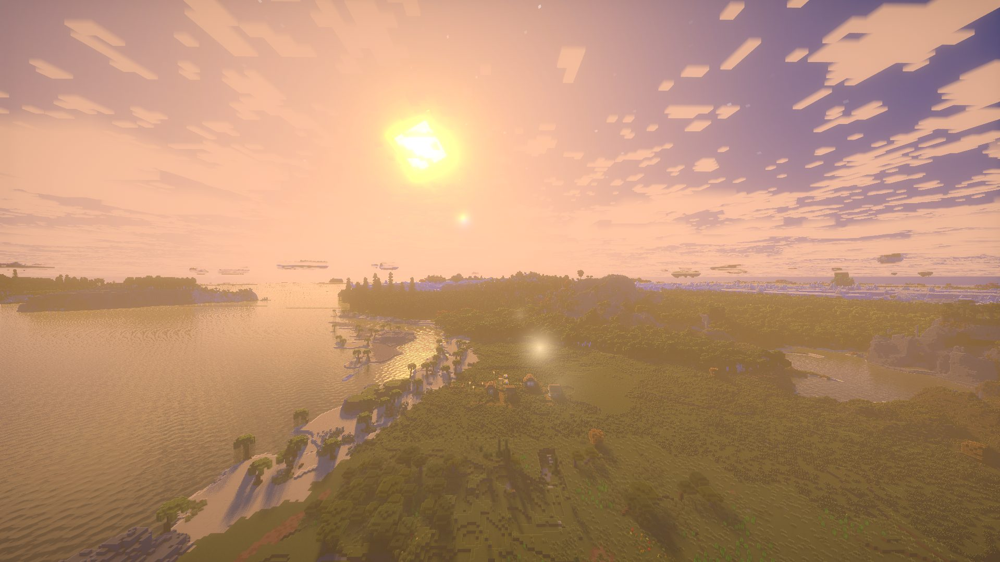
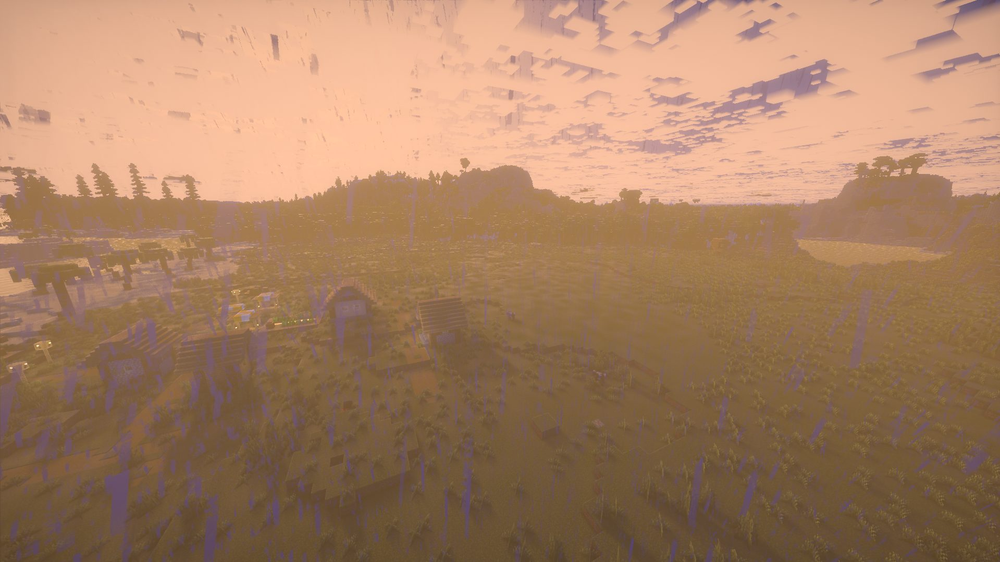

# SDV-Voxy-compatible

终于将停更1年的super duper vanilla光影接近完整地voxy了！一天一夜，醒来了就去弄如何实现。

首先让deepseek快速阅读voxy与sdv的管线，不去考虑translucent、taa、shadowcast、ssao等等的具体实现，一遍跑通。

然后lod显示与vanilla chunk割裂，经过无数次测试后，终于搞清不能自己手搓魔法数字了，于是叫minimax去计算sdv的Lambert的具体公式，最后完美实现数学等同，光照效果终于相等。

但此时边界雾阻挡voxy的视野，于是就经验公式，先调几千区块外，然后不管。

然而，lod 的阴影依旧是原版的Canopy Shadow，不计算太阳角度，极其不自然！实施卡了好久好久啊，反复推翻前面的修改方案，lightmap根本无法实现castshadow，最后终于想起去看photon的具体实现，于是发现ssss可以绕过csm与voxy握手，终于成功实现castshadow

但问题又来了，在lod与vanilla chunk（vc)的过渡区，当接受面是vanilla而遮挡物又是voxy时，阴影被截断。于是采纳gpt的方案，将阴影按 caster 来源分解，vanilla 接收面 = 原有 SDV CSM/Lambert × Voxy-only 遮蔽

Voxy 接收面    = SDV CSM × Voxy-only 遮蔽 × 原有 LOD 直接光。完美解决。

然而问题又来了，lod与vc感觉又有区别，先怀疑是taa管线，sdv的taa处理非常简短，于是接入voxy。但差异依旧存在，肉眼多次观察法，发现是纹理不同。叫gpt生成了个纹理测试资源包，发现资源包纹理并没有变，于是叫gpt翻源码可得，voxy在处理草地纹理时固定翻转角度了，采用单次乘加哈希重新打乱草地的纹理旋转。收官。

顺手还让gpt修复了sdv的发光浆果显示异常、雾的经验公式，湿润pbr的表面、雨天的Lambert变化，lod植被阴影。

最后就是水面效果攻坚战，先让gpt读取完整的sdv水面函数，再在lod有损的水面效果中，构造严格的mathematical equality，一轮对话直接实现。但问题来了，lod水面却依旧不跟vc等价，依旧更透明更亮！！完全摸不到头脑，然后突然想到，bsl似乎也是forward+deferred架构，进游戏测试发现lod与vc几乎完美等价，于是立马叫gpt去抄作业，然后发现voxy 输出的颜色用 BSL 自己的公式生成，根本不进入 vanilla G-buffer。但gpt额度用完了，干！

最后抄了photon的水面效果。目前个人使用非常满意。

## 截图

## 目前仍存在以下问题

1.开启dungeon描边会导致lod与vanilla chunk边缘产生差异，肉眼可见，但不明显，将描边亮度降低至0.5即可。

2.水下视角漏光（待修）

3.使用了dFdx/dFdy/discard，derivatives 可能未定义,discard 未来也可能不受voxy支持

## License

本项目是 Super Duper Vanilla 的 modified version,按 [FlameRender License 1.6](LICENSE) 分发。`shaders/lib/voxy/photonDistantWater.glsl` 衍生自 Photon 的水面设计,完整 Photon 许可证文本见 [PHOTON_LICENSE](PHOTON_LICENSE)。致谢与第三方代码归属见 [CREDITS.md](CREDITS.md)。
